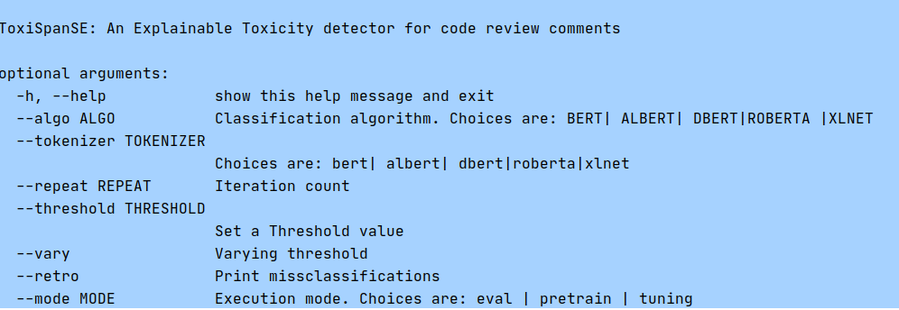

# ToxiSpanSE
An Explainable Toxicity detector for code review comments. Published in ACM/IEEE International Symposium on Empirical Software Engineering and Measurement (ESEM)'2023

Read Our Papers <br />
#[ESEM-23: "ToxiSpanSE: An Explainable Toxicity Detection in Code Review Comments"]

## Datasets
Our code review dataset is found at: /models/CR_full_span_dataset.xlsx <br>
You can find also same dataset with .csv file. We used .xlsx one. 
This Code Review (CR) dataset contains 19,651 comments where 3757 of them are labeled as toxic. The source of binary labeled (each CR comment labeled as 0 or 1) dataset is: https://github.com/WSU-SEAL/ToxiCR

We labeled the toxic spans of 3757 toxic samples and one can find the target toxic span offsets in our dataset file. Also, we consider the non-toxic CR comments do not contain any toxic span. 

## Instructions to use the tool 
clone/download the project </br>
$git clone https://github.com/WSU-SEAL/ToxiSpanSE.git

#install all the requirements: </br>
$ pip install -r "requirements.txt"

ToxiSpanSE is user friendly tool. You can view all the options by using the following command:
$ python ToxiSpanSE.py --h

<p align="center">
  
</p>

## Instructions in Details

Most of the commands are written in run.sh file. You can run it by:
$sh run.sh 

To run the ToxiSpanSE model, you should put following:
$python ToxiSpanSE.py

The above command will execute the best Model RoBERTa with varying the threshold value. 

To run a specific model (i.e, BERT) and generate the metrics with different threshold (0.01 to 0.99) in validation set, use

$python ToxiSpanSE.py --algo bert --tokenizer bert --vary

To run a model (best model is RoBERTa) with a specific threshold (best threshold=0.12), use the following command:
$python ToxiSpanSE.py --algo roberta --tokenizer roberta --threshold 0.12

To print the misclassification, use the --retro argument. 
$python ToxiSpanSE.py --algo roberta --tokenizer roberta --threshold 0.12 --retro

The error classification file provides explainable toxicity prediction by tagging toxic words. Following is an example of predicted text:
This  looks  like  a  very   <toxic> ugly  hack </toxic> 


To run the Naive Algorithm (lexicon-matching based), use:
$python naive_algorithm.py
This naive algorithm uses 167 common toxic keywords from a list (/models/toxic_token_list.csv)

To calculate the Inter Rater Agreement score 'krippendorff's alpha' use:
$python krippendorff_alpha.py

to agrregate the results from all thresholds in validation set and find the optimal threshold using graph
$python aggregate_results.py


We use a list of 240 tokens in /models/full_token_list.csv. We added these tokens to each pre-trained tokenizers. This list can be omitted. 
Sometimes, pre-trained tokenizers split the words into subwords. After adding these tokens, tokenizers help to gain more explainibility by making 
toxic tagging understandable to users. 


## Copyright Information
 Copyright Software Engineering Analytics Lab (SEAL), Wayne State University, 2023
 Authors: Jaydeb Sarker <jaydebsarker@wayne.edu> and Amiangshu Bosu <abosu@wayne.edu>

This program is free software; you can redistribute it and/or
modify it under the terms of the GNU General Public License
version 3 as published by the Free Software Foundation.

This program is distributed in the hope that it will be useful,
but WITHOUT ANY WARRANTY; without even the implied warranty of
MERCHANTABILITY or FITNESS FOR A PARTICULAR PURPOSE. See the
GNU General Public License for more details.


## Citation for our papers
If you use our work, please cite our paper:

ESEM-23: "ToxiSpanSE: An Explainable Toxicity Detection in Code Review Comments"
```
@article{,
author = {Sarker, Jaydeb and Sultana, Sayma and Wilson, Steve and Bosu, Amiangshu},
title = {ToxiSpanSE: An Explainable Toxicity Detection in Code Review Comments},
year = {2023},
publisher = {},
address = { },
issn = { },
url = { },
doi = { },
booktitle = {Proceedings of the 17th ACM/IEEE International Symposium on Empirical Software Engineering and Measurement},
articleno = {},
numpages = {},
keywords = {},
location = {},
series = {ESEM '23}
}
```

